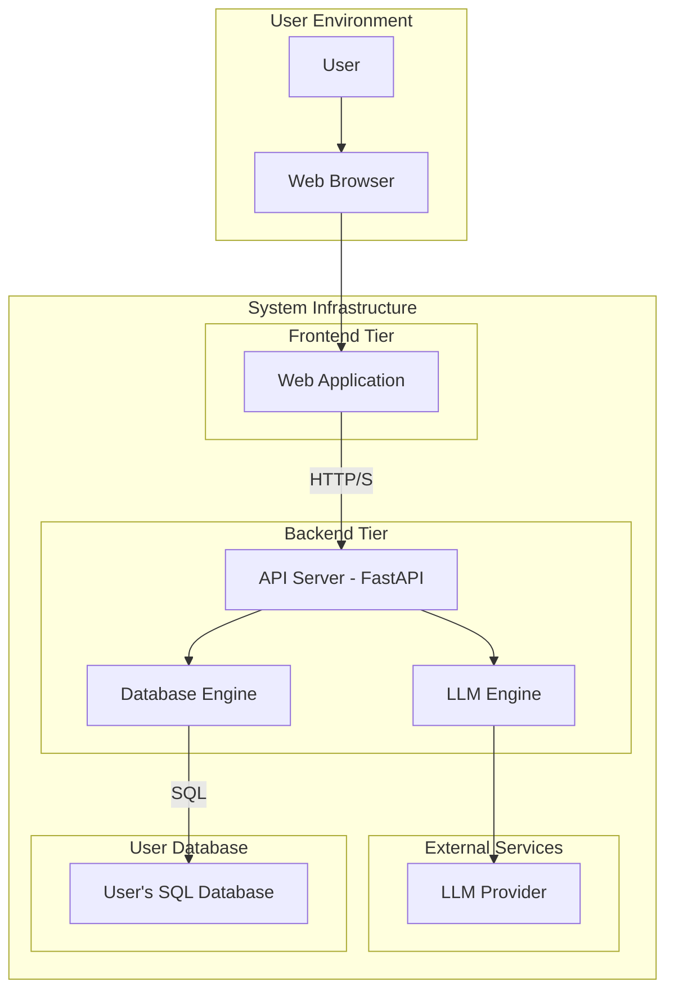
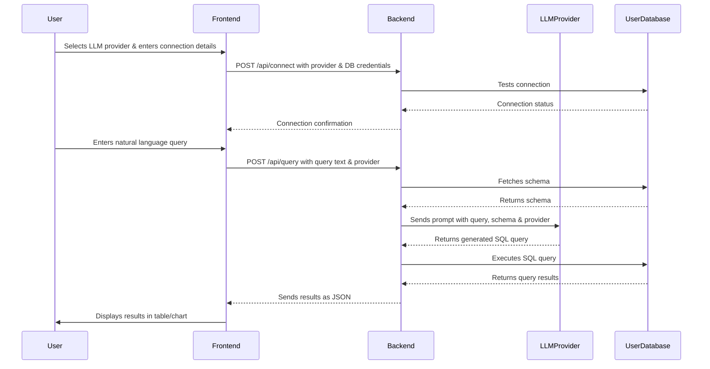

# EasyQuery - System Architecture

This document outlines the complete architecture for the EasyQuery project, a natural language interface for databases.

## 1. High-Level Architecture

The system is designed as a classic three-tier architecture, composed of a frontend, a backend, and the user's database. The entire application will be containerized using Docker for portability and ease of deployment.

## 2. Component Breakdown

### 2.1. Frontend Architecture

The frontend is a single-page application (SPA) built with vanilla HTML, CSS, and JavaScript. It provides the user interface for interacting with the system.

*   **UI Components**:
    *   **Connection Manager**: A form to securely input and manage database connection credentials.
    *   **Chat Interface**: A conversational UI for users to input natural language queries.
    *   **Results Display**: A component to render query results in both tabular and graphical formats.
    *   **Schema Explorer**: A tree-view to display the schema of the connected database.
*   **Technology Stack**:
    *   HTML5, CSS3, JavaScript (ES6+)
    *   No framework to keep it lightweight.
    *   `fetch` API for backend communication.
    *   A charting library (e.g., Chart.js or D3.js) for data visualization.

### 2.2. Backend Architecture

The backend is a Python-based application powered by FastAPI, responsible for all business logic.

*   **API Server (FastAPI)**:
    *   Exposes RESTful endpoints for the frontend.
    *   Handles user requests, authentication, and validation.
    *   Orchestrates the interaction between the LLM engine and the database engine.
*   **LLM Engine**:
    *   Features a generic LLM wrapper/ABC class to handle various LLM providers (Groq, OpenAI, Gemini, Anthropic, etc.).
    *   Manages LLM-specific configurations and API calls.
    *   Constructs context-aware prompts, including the database schema, to translate natural language queries into SQL.
*   **Database Engine**:
    *   A robust engine using SQLAlchemy to handle connections to any SQL/relational database.
    *   Supports both remote and local database paths.
    *   Manages database connections, pooling, and secure execution of SQL queries for various dialects (MySQL, PostgreSQL, SQL Server, Oracle, SQLite, etc.).
*   **Technology Stack**:
    *   Python 3.10+
    *   FastAPI for the API server.
    *   SQLAlchemy for database abstraction.
    *   `speech_recognition` for voice input.
    *   `uvicorn` as the ASGI server.

## 3. Data Flow and Interactions

The following diagram illustrates the sequence of operations for a typical user query, including LLM provider selection.

## 4. Deployment and Containerization

The application will be containerized using Docker and orchestrated with Docker Compose for simplified development and deployment.

*   **`frontend` service**:
    *   A lightweight Nginx container to serve the static frontend files.
    *   Configured as a reverse proxy to forward `/api` requests to the backend, avoiding CORS issues.
*   **`backend` service**:
    *   A Python container running the FastAPI application.
*   **`docker-compose.yml`**:
    *   Defines the `frontend` and `backend` services.
    *   Manages networking between the containers.

This architecture ensures a scalable, maintainable, and deployable system.